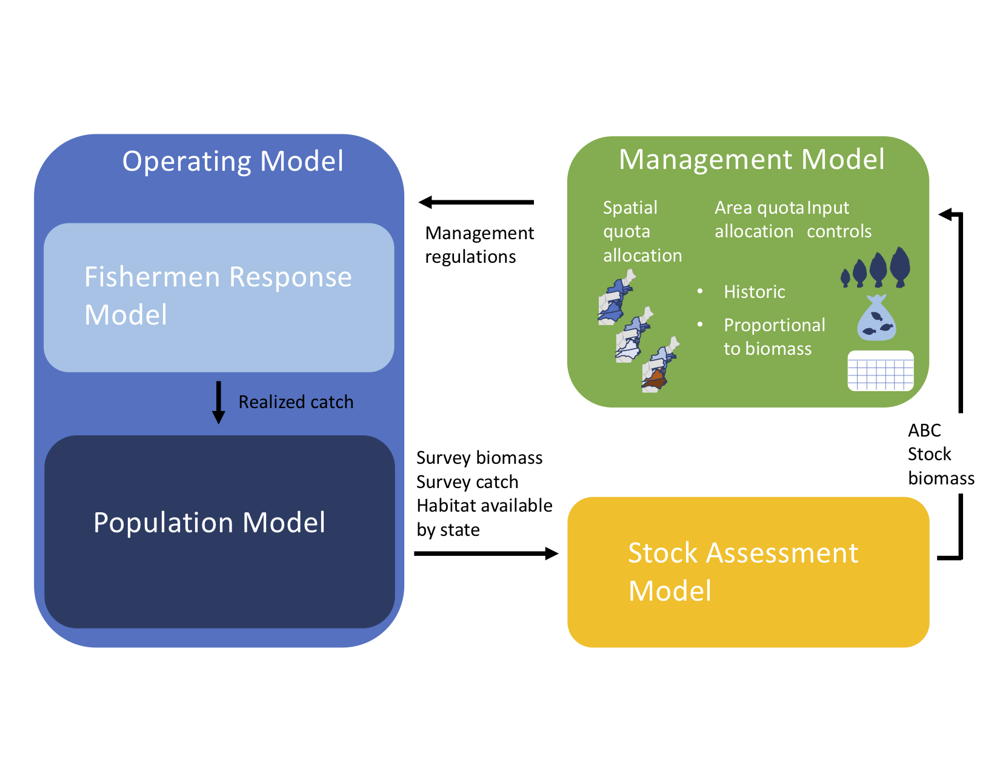

# flukeclimatemse

## Overview
**flukeclimatemse** is a package to perform a Management Strategy Evaluation (MSE) to test the efficacy of spatio-temporal management actions for the recreational Summer Flounder fishery given climate driven population shifts. This MSE simulation framework is broken into 4 model components: an operating model, a stock assessment model, a model of the management procedure, and a fishermen response model. Model components are supported by independently defined functions. 

**MSE modelling framework and functions:**



## Functions
`runFlukeMSE( )` runs the full MSE, stepping through each model component for specified number of projected years.
+ `flukeOM( )` 
  - `truestocksize( )`
  - `dosurveys( )`
  - `thermalhabitat( )`
+ `stockassess( )`
+ `mngmtprocedure( )`
  - `decisionarea( )`
  - `allocatequota( )`
  - `inputcontrols( )`
+ `fishermenresponse( )`

## Installation
```
# This package can be installed directly from github:

install_github("https://github.com/ahart1-r-packages/flukeclimatemse.git")
```

## Usage
```
library(flukeclimatemse)

# This package is still in development so no examples are currently available. 
```

